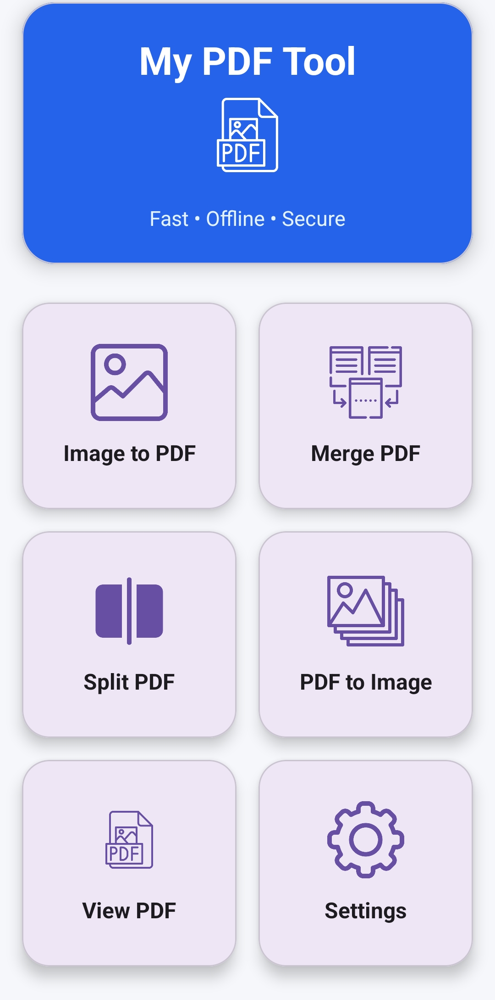
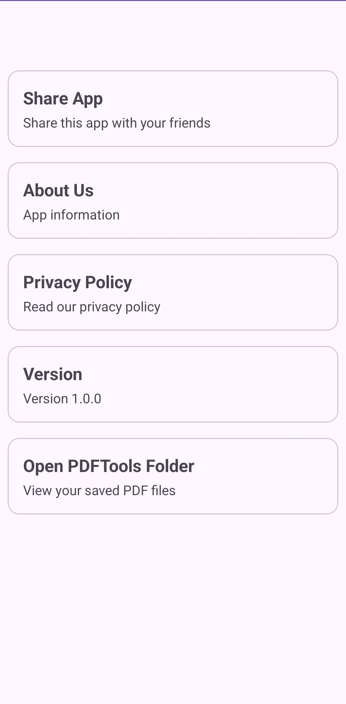
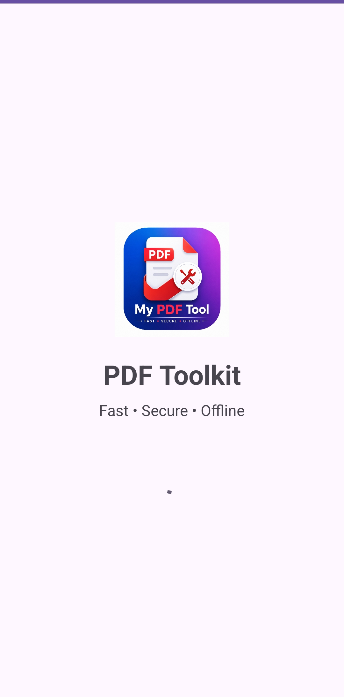

# 📄 PDF Tool

**PDF Tool** is an Android application designed to make everyday PDF and document management simple, fast, and convenient.

## ✨ Features

* 📷 **Image to PDF** — Convert images into PDF documents.
* 📄 **Merge PDF** — Combine multiple PDF files into one document.
* ✂️ **Split PDF** — Extract selected pages from PDF files.
* 🖼️ **PDF to Image** — Convert PDF pages into images.
* 👁️ **PDF Viewer** — View and read PDF documents directly in the app.

## 📱 Screenshots

### Splash Screen
## 📸 Screenshots

## 🛠️ Technologies

* Android
* Kotlin
* Jetpack Compose
* Material Design

## 🚀 Download

The latest APK is available in the **Releases** section of this repository.

## 📌 Project Status

**Version:** 1.0.0
**Status:** Initial Release

## 👨‍💻 Developer

**Obaid ur Rehman**

Android Developer | Kotlin | Jetpack Compose | Python | React | Node.js
